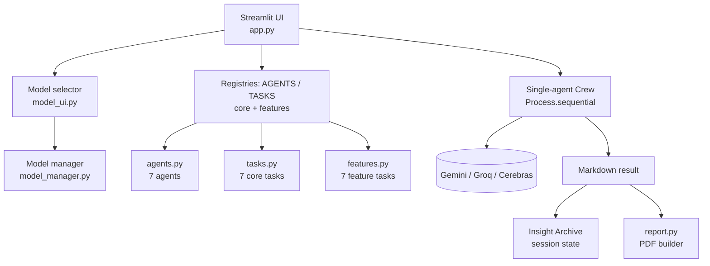

# 🎯 CareerOps AI — Career Assistant AI

**Career Assistant AI** (UI name: *CareerOps AI*) is a multi-agent career assistant built with **Python, Streamlit and CrewAI**. Upload your CV, paste a job description, pick one of 14 analysis types, and get a focused AI-generated report you can download as a branded PDF.

It runs on **free-tier models from three providers — Google Gemini, Groq and Cerebras** — and you choose the model from the Settings panel. You only need an API key for the provider you want to use.

---

## 📑 Table of contents

- [Features](#-features)
- [How it works](#-how-it-works)
- [Architecture](#-architecture)
- [Project structure](#-project-structure)
- [Supported models](#-supported-models)
- [Installation](#-installation)
- [API key configuration](#-api-key-configuration)
- [Using the app](#-using-the-app)
- [PDF reports](#-pdf-reports)
- [Error handling](#-error-handling)
- [Deployment](#-deployment)
- [Privacy and security](#-privacy-and-security)
- [Known limitations](#-known-limitations)
- [Extending the project](#-extending-the-project)
- [Roadmap](#-roadmap)

---

## 🚀 Features

- **14 analysis types** in one dropdown: 7 core agents plus 7 feature tasks that reuse those agents.
- **One agent per run.** You choose what to run; nothing executes automatically.
- **Multi-provider model selector** (Gemini, Groq, Cerebras) with live API-key validation.
- **CV upload** (PDF / TXT) or paste text, plus a separate job description tab.
- **Job Match Score meter** with a weighted four-category breakdown.
- **Job Legitimacy score meter** for spotting risky or scam postings.
- **Insight Archive** that keeps your last 30 results so you can switch agents without losing earlier output.
- **Optional context briefing** for extra instructions (tone, timeframe, company name, and so on).
- **Branded PDF download** for every result, with a plain-text fallback.
- **Automatic retry** for temporary API failures, and clear messages for quota limits.
- **Resizable, collapsible Settings and Analysis panels** on a dark UI.

### Core agents

| Agent | What it does |
| --- | --- |
| 🧭 **Manager** | Career goal analysis, job requirements, strengths, gaps and next steps |
| 💼 **Job Analyst** | Breaks a job description into responsibilities, required/preferred qualifications, skills, tools, certifications and keywords |
| 📄 **CV Analyst** | Compares your CV with the job: skills, education, experience, projects, matches, missing requirements, weak areas and CV improvements |
| 🏢 **Research Agent** | Company and opportunity analysis based **only on the text you provide** (no live web access) |
| ✍️ **Application Agent** | Professional summary, CV improvements, keywords, improved bullets, cover-letter guidance, application strategy and suggested answers |
| 🎤 **Interview Agent** | Technical, behavioral, situational, job-specific and CV-based questions, answer frameworks, STAR guidance and questions to ask the interviewer |
| 🔎 **Critic Agent** | Quality review: missing requirements, weak evidence, generic content, unsupported claims, inconsistencies and specific fixes |

### Feature tasks

Each of these is a dedicated task that runs on one of the core agents.

| Feature | Powered by | What it does |
| --- | --- | --- |
| 🎯 **Job Match Score** | CV Analyst | Overall match percentage, four-category breakdown, reasons for and against, and fastest ways to raise the score |
| 🧩 **Skill Gap Detector** | CV Analyst | Table of missing/weak skills ranked Critical / Important / Nice-to-have, skills you already show, and quick wins |
| ✉️ **Cover Letter Generation** | Application Agent | A 280–350 word tailored cover letter, what it emphasizes, and what to check before sending |
| 🗺️ **Career Roadmap** | Manager | Phased learning plan (default 90 days, 8 h/week), priority skills, portfolio projects, resources, application strategy and interview prep |
| 🛡️ **Job Legitimacy Check** | Research Agent | Legitimacy score (0–100), green and red flags, what to verify before applying, and a recommendation |
| 🏭 **Company Check** | Research Agent | Company snapshot, reputation signals and recruiter questions, **from the job text only** |
| 🔀 **Similar Roles** | Manager | Alternative job titles, adjacent career paths, transferable skills and where to search |

**Tips**

- Put the company name, hiring manager or preferred tone in the briefing to personalise the cover letter.
- Put a timeframe and weekly hours in the briefing (for example, "6 months, 10 hours per week") to shape the roadmap.
- All agents are instructed never to invent skills, experience or company facts. Missing information is reported as *"Not found in the provided documents."*

#### How the Job Match Score is calculated

| Category | Weight |
| --- | --- |
| Technical Skills | 40% |
| Experience and Projects | 30% |
| Education and Certifications | 10% |
| Keywords and Soft Skills | 20% |

When all four category scores are present in the output, the app **recalculates the overall percentage itself** from these weights, so the number you see always matches the breakdown.

---

## 🔄 How it works

1. **Choose a model** in *Settings*. A green indicator means a valid API key was found.
2. **Add your CV** (upload a file or paste text) in the **CV** tab.
3. **Add the job description** in the **Job description** tab.
4. **Pick an analysis type** in the *Analysis* panel. Optionally open the context briefing to add extra instructions.
5. Open the **Run** tab and click **Run <agent>**. Both the CV and the job description are required.
6. The selected agent runs alone in a single-agent CrewAI crew.
7. The result appears as expandable sections (and a full report). It is saved to the **Insight Archive**.
8. Click **Download PDF** to keep the report.

```
CV + Job Description + (optional briefing)
                │
                ▼
        Selected analysis type
                │
                ▼
   Single-agent CrewAI crew (sequential)
                │
                ▼
     LLM (Gemini / Groq / Cerebras)
                │
                ▼
   Markdown result → Insight Archive → PDF
```

---

## 🏗️ Architecture



Agents are created **without an LLM**. At runtime, `model_manager.configure_agents()` builds one LLM for the selected model (temperature 0.2) and assigns it to every agent, which keeps the agents provider-independent.

---

## 🧩 Project structure

```
career-assistant-ai/
├── app.py                        # Streamlit app: layout, state, run logic, results
├── agents.py                     # The 7 CrewAI agents (no LLM attached)
├── tasks.py                      # The 7 core tasks and the TASKS registry
├── features.py                   # 7 feature tasks, registries, match-score parser
├── model_manager.py              # Model catalog, API-key validation, LLM builder
├── model_ui.py                   # Sidebar/panel model selector widget
├── report.py                     # Markdown → branded A4 PDF (ReportLab)
├── tools.py                      # PDF text extraction + web/query helper tools
├── memory.py                     # CareerMemory session dataclass
├── careerop-ai-features.patch    # Patch file containing the feature additions
├── requirements.txt
└── README.md
```

| File | Responsibility |
| --- | --- |
| `app.py` | Page config and CSS, session state, the three-panel layout (Settings · centre workspace · Analysis), CV upload, validation, running the selected agent, retry logic, rendering results, Insight Archive, PDF/text download |
| `agents.py` | Manager, Job Analyst, CV Analyst, Research, Application, Interview and Critic agents. Each has a role, goal and backstory that forbids inventing information, and `allow_delegation=False` |
| `tasks.py` | Prompt/task definitions with `{cv_text}`, `{job_description}` and `{career_request}` placeholders |
| `features.py` | Job Match Score, Skill Gap Detector, Cover Letter, Career Roadmap, Job Legitimacy Check, Company Check, Similar Roles, and `parse_match_score()` |
| `model_manager.py` | `MODEL_CATALOG`, key validation rules per provider, default-model priority, `build_llm()` and `configure_agents()` |
| `model_ui.py` | `render_model_selector()` — dropdown with 🟢/⚪ key status |
| `report.py` | `build_pdf()` — banner, details strip, request box, optional score card, Markdown-to-PDF rendering, page headers/footers |
| `tools.py` | `extract_cv_text` (pypdf), `search_web` and `prepare_company_query` helper tools |
| `memory.py` | `CareerMemory` dataclass for session-level career data |

---

## 🤖 Supported models

All models are used on their free tiers. The app picks the first available model in this priority order, and you can switch at any time.

| Provider | Models | Secret name |
| --- | --- | --- |
| **Google Gemini** | Gemini 3.8 Flash · Gemini 3.5 Flash-Lite · Gemini 2.5 Flash | `GEMINI_API_KEY` |
| **Groq** | GPT-OSS 120B · GPT-OSS 20B · Qwen3.8 27B | `GROQ_API_KEY` |
| **Cerebras** | Llama 3.3 70B · Llama 3.1 8B | `CEREBRAS_API_KEY` |

Model IDs are defined in `MODEL_CATALOG` inside `model_manager.py`. If a provider renames or retires a model, update the ID there.

---

## 💻 Installation

**Requirements:** Python 3.10 or newer (needed by CrewAI) and an API key for at least one supported provider.

```bash
# 1. Clone
git clone https://github.com/Ghazna-Ali/career-assistant-ai.git
cd career-assistant-ai

# 2. Create a virtual environment
python -m venv venv
# Windows
venv\Scripts\activate
# macOS / Linux
source venv/bin/activate

# 3. Install dependencies
pip install -r requirements.txt

# 4. Add at least one API key (see below), then run
streamlit run app.py
```

### Dependencies

`streamlit` · `crewai[google-genai,litellm]` · `crewai-tools` · `pypdf` · `requests` · `beautifulsoup4` · `reportlab` · `litellm`

---

## 🔐 API key configuration

Keys are read from **Streamlit secrets first, then environment variables**. Placeholder values such as `your_api_key_here` are treated as missing.

**Option A — Streamlit secrets** (recommended). Create `.streamlit/secrets.toml`:

```toml
GEMINI_API_KEY = "your_gemini_key"
GROQ_API_KEY = "your_groq_key"
CEREBRAS_API_KEY = "your_cerebras_key"
```

**Option B — environment variables**

```bash
# macOS / Linux
export GEMINI_API_KEY="your_gemini_key"

# Windows PowerShell
$env:GEMINI_API_KEY="your_gemini_key"
```

You only need the key for the provider whose model you select. The app validates each key's length and format and tells you what is wrong, for example a Groq key must start with `gsk_`.

Where to get free keys:

- Gemini — <https://aistudio.google.com/apikey>
- Groq — <https://console.groq.com/keys>
- Cerebras — <https://cloud.cerebras.ai>

> **Never commit API keys.** Add `.streamlit/secrets.toml` and any `.env` file to `.gitignore`.

---

## 🖥️ Using the app

### Layout

| Area | Contents |
| --- | --- |
| **Settings** (left, collapsible) | Panel-width slider, model selector, key/model status, **Reset workspace** |
| **Centre workspace** | Header, panel toggles, selected agent, and three tabs: **CV**, **Job description**, **Run** |
| **Analysis** (right, collapsible) | Panel-width slider, analysis-type dropdown, **Insight Archive**, optional **Context briefing** and a quick-note box |

### Context briefing (optional)

Turn on *Show briefing fields* to add extra instructions such as "Focus on remote roles in Europe" or "6 months, 10 hours per week". The quick-note box appends short notes to the briefing. If left empty, each agent runs its standard task.

### Insight Archive

Every successful run is stored in the session (newest first, up to 30 kept, 12 shown). Click an entry to reopen it and download its PDF.

### Result view

Results are split on `##` headings into expandable sections, with a **Full report** expander. *Job Match Score* shows a percentage meter and per-category metrics; *Job Legitimacy Check* shows a score out of 100.

---

## 📄 PDF reports

`report.py` converts the Markdown output into an A4 PDF using ReportLab and standard fonts (no font files required):

- Title banner with the agent and report type
- Details strip (agent, report type, generation time)
- Your career request, when provided
- A **score card** for Job Match Score reports
- Headings, bullet and numbered lists, tables, bold/italic/inline code, quotes and code blocks
- Running header and "Page X of Y" footer with an AI-guidance disclaimer

Emoji and characters outside Windows-1252 are stripped so the standard fonts render cleanly. If PDF generation fails, the app falls back to a plain `.txt` download and shows the error.

---

## 🛠️ Error handling

- **Temporary errors** (HTTP 429/500/502/503/504, unavailable, rate-limit style messages) are retried up to **4 attempts** with 5 s, 15 s and 30 s delays.
- **Daily quota / usage-limit errors** are *not* retried; the app shows a clear "provider quota reached" message.
- **Stuck runs:** a run marked as running for more than 10 minutes is flagged as failed, and **Clear status** resets it.
- Invalid or missing keys are reported in Settings before you run.

---

## ☁️ Deployment

The app is designed for **Streamlit Community Cloud**:

1. Push the repository to GitHub.
2. Create a new Streamlit app pointing to `app.py`.
3. In **Settings → Secrets**, add one or more of `GEMINI_API_KEY`, `GROQ_API_KEY`, `CEREBRAS_API_KEY`.
4. Deploy.

The repository needs `app.py`, `agents.py`, `tasks.py`, `features.py`, `tools.py`, `memory.py`, `model_manager.py`, `model_ui.py`, `report.py` and `requirements.txt`.

---

## 🔒 Privacy and security

- Your CV and job description are held in the Streamlit **session** only. The app has no database and does not write them to disk (uploaded files are written to a temporary file for text extraction and then deleted).
- The text you submit **is sent to the model provider you select** (Google, Groq or Cerebras). Avoid including information you do not want shared with them.
- Keep API keys in secrets or environment variables, never in source code, notebooks, logs or commit history.

---

## ⚠️ Known limitations

- **AI output must be reviewed.** Results can contain wrong inferences or generic advice. Verify everything before using it in an application.
- **No live web research.** The Research Agent and Company Check analyse only the text you provide. `tools.py` includes `search_web` and `prepare_company_query` helper tools, but they are not attached to any agent.
- **CV parsing:** text extraction uses `pypdf`, so it works for **text-based PDFs**. Scanned/image PDFs return no text, and DOCX files are accepted by the uploader but are not parsed by the current extractor, so paste DOCX content into the CV box instead.
- **Session-only state.** Closing or refreshing the page clears your CV, job description and Insight Archive.
- **Free-tier limits.** Providers enforce rate and daily limits; switch models if you hit one.
- **`memory.py`** defines a `CareerMemory` dataclass, but the app's working state currently lives in Streamlit session state.

---

## 🧱 Extending the project

**Add a new analysis type**

1. Reuse an existing agent from `agents.py`, or define a new one.
2. Create a `Task` with `{cv_text}`, `{job_description}` and `{career_request}` placeholders (see `features.py`).
3. Register it in `FEATURE_AGENTS`, `FEATURE_TASKS` and `FEATURE_DESCRIPTIONS`. `app.py` merges these registries automatically.
4. Run it and check the output and the PDF.
5. Update this README.

**Add a new model**

Add a `ModelSpec` to `MODEL_CATALOG` in `model_manager.py`, append its key to `DEFAULT_MODEL_PRIORITY`, and add key rules to `KEY_RULES` if it uses a new provider.

---

## 🔮 Roadmap

- DOCX CV parsing and OCR for scanned PDFs
- Live company research using the existing search helper tools
- Export to DOCX
- Persistent user profiles and application tracking
- Interactive interview simulation
- Multi-language support

---

## 📄 License

No license has been selected yet. Add a `LICENSE` file before distributing the project as open source.
